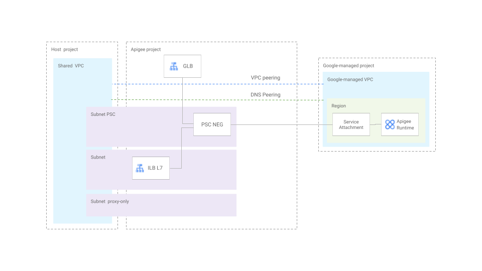
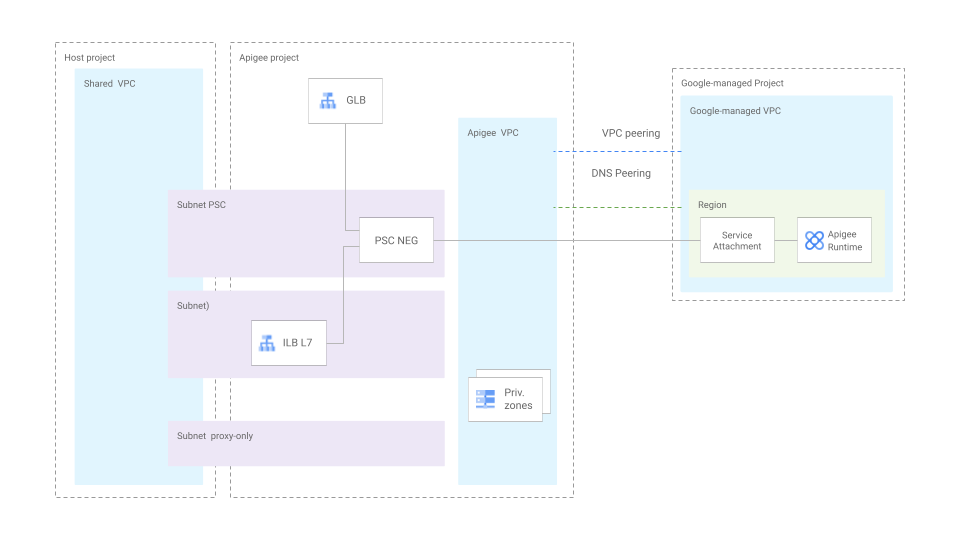
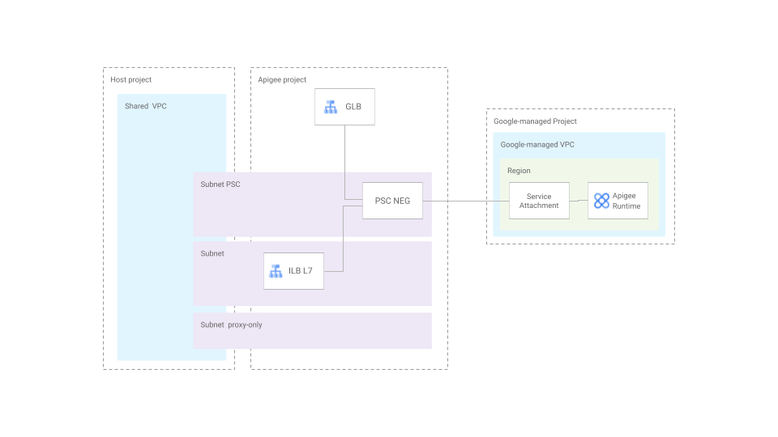
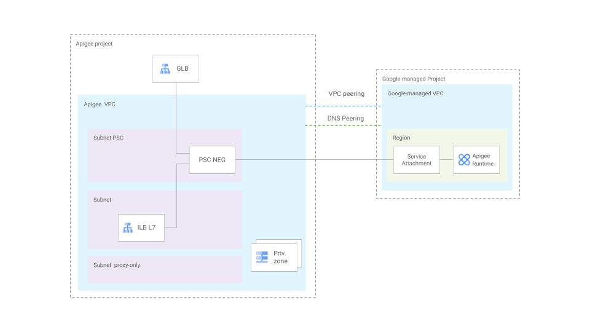
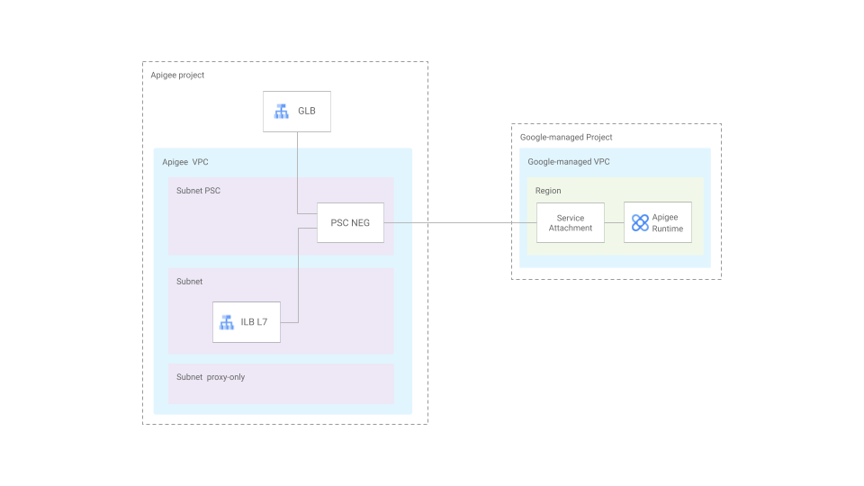

# Apigee Foundations

This module creates all the resources necessary to set up Apigee X on Google Cloud. Find below a few examples of different Apigee architectures that can be created using this module.

Apigee can be exposed to clients using Regional Internal Application Load Balancer, Global External Application Load Balancer or both. When using the Regional Internal Application Load Balancer, self-managed certificates (incuding self-signed certificates generated in this same module) can be used. When using the Global External Application Load Balancer Google-managed certificates or self-managed certificates (including self-signed certificates generated in this same module).

## Examples

### Apigee X in a service project with the shared VPC in the host project as peered / authorized network



```hcl
module "apigee-x-foundations" {
  source = "./fabric/blueprints/apigee/apigee-x-foundations"
  project_config = {
    billing_account_id = var.billing_account_id
    parent             = var.folder_id
    name               = var.project_id
    iam = {
      "roles/apigee.admin" = ["group:apigee-admins@myorg.com"]
    }
    shared_vpc_service_config = {
      host_project = "my-host-project"
    }
  }
  apigee_config = {
    addons_config = {
      api_security = true
    }
    organization = {
      analytics_region = "europe-west4"
    }
    envgroups = {
      apis = [
        "apis.external.myorg.com",
        "apis.internal.myorg.com"
      ]
    }
    environments = {
      apis = {
        envgroups = ["apis"]
      }
    }
    instances = {
      europe-west4 = {
        external                      = true
        runtime_ip_cidr_range         = "10.0.0.0/22"
        troubleshooting_ip_cidr_range = "192.168.0.0/18"
        subnet = {
          id = "projects/my-host-project/regions/europe-west4/subnetworks/my-subnet-eu4"
        }
        subnet_psc = {
          id = "projects/my-host-project/regions/europe-west4/subnetworks/my-subnet-psc-eu4"
        }
        environments = ["apis"]
      }
    }
    endpoint_attachments = {
      endpoint-backend-1 = {
        region             = "europe-west4"
        service_attachment = "projects/a58971796302e0142p-tp/regions/europe-west4/serviceAttachments/apigee-europe-west4-2s2d"
      }
    }
  }
  shared_vpc_config = {
    id             = var.vpc.id
    use_for_apigee = true
  }
  net_lb_app_ext_config = {
    ssl_certificates = {
      create_configs = {
        default = {
          certificate = "PEM-Encoded certificate string"
          private_key = "PEM-Encoded private key string"
        }
      }
    }
  }
  net_lb_app_int_config = {
    ssl_certificates = {
      create_configs = {
        default = {
          certificate = "PEM-Encoded certificate string"
          private_key = "PEM-Encoded private key string"
        }
      }
    }
  }
}
# tftest modules=7 resources=50
```

### Apigee X in a service project with a local VPC as peered / authorized network



```hcl
module "apigee-x-foundations" {
  source = "./fabric/blueprints/apigee/apigee-x-foundations"
  project_config = {
    billing_account_id = "1234-5678-0000"
    parent             = "folders/123456789"
    name               = "my-project"
    iam = {
      "roles/apigee.admin" = ["group:apigee-admins@myorg.com"]
    }
    shared_vpc_service_config = {
      host_project = "my-host-project"
    }
  }
  apigee_config = {
    addons_config = {
      api_security = true
    }
    organization = {
      analytics_region = "europe-west4"
    }
    envgroups = {
      apis = [
        "apis.external.myorg.com",
        "apis.internal.myorg.com"
      ]
    }
    environments = {
      apis = {
        envgroups = ["apis"]
      }
    }
    instances = {
      europe-west4 = {
        runtime_ip_cidr_range         = "10.0.0.0/22"
        troubleshooting_ip_cidr_range = "192.168.0.0/18"
        subnet = {
          ip_cidr_range = "172.16.0.0/29"
        }
        subnet_psc = {
          ip_cidr_range = "172.16.1.0/29"
        }
        environments = ["apis"]
      }
    }
    endpoint_attachments = {
      endpoint-backend-1 = {
        region             = "europe-west4"
        service_attachment = "projects/a58971796302e0142p-tp/regions/europe-west4/serviceAttachments/apigee-europe-west4-2s2d"
        dns_names = [
          "*"
        ]
      }
    }
  }
  shared_vpc_config = {
    id             = var.vpc.id
    use_for_apigee = false
  }
  net_lb_app_ext_config = {
    ssl_certificates = {
      create_configs = {
        default = {
          certificate = "PEM-Encoded certificate string"
          private_key = "PEM-Encoded private key string"
        }
      }
    }
  }
  net_lb_app_int_config = {
    ssl_certificates = {
      create_configs = {
        default = {
          certificate = "PEM-Encoded certificate string"
          private_key = "PEM-Encoded private key string"
        }
      }
    }
  }
}
# tftest modules=9 resources=62
```

### Apigee X in a service project with peering disabled



```hcl
module "apigee-x-foundations" {
  source = "./fabric/blueprints/apigee/apigee-x-foundations"
  project_config = {
    billing_account_id = "1234-5678-0000"
    parent             = "folders/123456789"
    name               = "my-project"
    iam = {
      "roles/apigee.admin" = ["group:apigee-admins@myorg.com"]
    }
    shared_vpc_service_config = {
      host_project = "my-host-project"
    }
  }
  apigee_config = {
    addons_config = {
      api_security = true
    }
    organization = {
      analytics_region    = "europe-west4"
      disable_vpc_peering = true
    }
    envgroups = {
      apis = [
        "apis.external.myorg.com",
        "apis.internal.myorg.com"
      ]
    }
    environments = {
      apis = {
        envgroups = ["apis"]
      }
    }
    instances = {
      europe-west4 = {
        runtime_ip_cidr_range         = "10.0.0.0/22"
        troubleshooting_ip_cidr_range = "192.168.0.0/18"
        subnet = {
          ip_cidr_range = "10.0.0.0/29"
        }
        subnet_psc = {
          ip_cidr_range = "10.2.0.0/29"
        }
        environments = ["apis"]
      }
    }
    endpoint_attachments = {
      endpoint-backend-1 = {
        region             = "europe-west4"
        service_attachment = "projects/a58971796302e0142p-tp/regions/europe-west4/serviceAttachments/apigee-europe-west4-2s2d"
      }
    }
    disable_vpc_peering = true
  }
  shared_vpc_config = {
    id = var.vpc.id
  }
  net_lb_app_ext_config = {
    ssl_certificates = {
      create_configs = {
        default = {
          certificate = "PEM-Encoded certificate string"
          private_key = "PEM-Encoded private key string"
        }
      }
    }
  }
  net_lb_app_int_config = {
    ssl_certificates = {
      create_configs = {
        default = {
          certificate = "PEM-Encoded certificate string"
          private_key = "PEM-Encoded private key string"
        }
      }
    }
  }
}
# tftest modules=8 resources=59
```

### Apigee X in a standalone project with peering enabled



```hcl
module "apigee-x-foundations" {
  source = "./fabric/blueprints/apigee/apigee-x-foundations"
  project_config = {
    billing_account_id = "1234-5678-0000"
    parent             = "folders/123456789"
    name               = "my-project"
    iam = {
      "roles/apigee.admin" = ["group:apigee-admins@myorg.com"]
    }
  }
  apigee_config = {
    addons_config = {
      api_security = true
    }
    organization = {
      analytics_region = "europe-west4"
    }
    envgroups = {
      apis = [
        "apis.external.myorg.com",
        "apis.internal.myorg.com"
      ]
    }
    environments = {
      apis = {
        envgroups = ["apis"]
      }
    }
    instances = {
      europe-west4 = {
        runtime_ip_cidr_range         = "172.16.0.0/22"
        troubleshooting_ip_cidr_range = "192.168.0.0/18"
        subnet = {
          ip_cidr_range = "10.0.0.0/29"
        }
        subnet_proxy_only_ip_cidr_range = "10.1.0.0/26"
        subnet_psc = {
          ip_cidr_range = "10.2.0.0/29"
        }
        environments = ["apis"]
      }
    }
  }
  net_lb_app_ext_config = {
    ssl_certificates = {
      create_configs = {
        default = {
          certificate = "PEM-Encoded certificate string"
          private_key = "PEM-Encoded private key string"
        }
      }
    }
  }
  net_lb_app_int_config = {
    ssl_certificates = {
      create_configs = {
        default = {
          certificate = "PEM-Encoded certificate string"
          private_key = "PEM-Encoded private key string"
        }
      }
    }
  }
}
# tftest modules=8 resources=58
```

### Apigee X in a standalone project with peering disabled



```hcl
module "apigee-x-foundations" {
  source = "./fabric/blueprints/apigee/apigee-x-foundations"
  project_config = {
    billing_account_id = "1234-5678-0000"
    parent             = "folders/123456789"
    name               = "my-project"
    iam = {
      "roles/apigee.admin" = ["group:apigee-admins@myorg.com"]
    }
  }
  apigee_config = {
    addons_config = {
      api_security = true
    }
    organization = {
      analytics_region    = "europe-west4"
      disable_vpc_peering = true
    }
    envgroups = {
      apis = [
        "apis.external.myorg.com",
        "apis.internal.myorg.com"
      ]
    }
    environments = {
      apis = {
        envgroups = ["apis"]
      }
    }
    instances = {
      europe-west4 = {
        subnet = {
          ip_cidr_range = "10.0.0.0/29"
        }
        subnet_proxy_only_ip_cidr_range = "10.1.0.0/26"
        subnet_psc = {
          ip_cidr_range = "10.2.0.0/29"
        }
        environments = ["apis"]
      }
    }
    disable_vpc_peering = true
  }
  net_lb_app_ext_config = {
    ssl_certificates = {
      create_configs = {
        default = {
          certificate = "PEM-Encoded certificate string"
          private_key = "PEM-Encoded private key string"
        }
      }
    }
  }
  net_lb_app_int_config = {
    ssl_certificates = {
      create_configs = {
        default = {
          certificate = "PEM-Encoded certificate string"
          private_key = "PEM-Encoded private key string"
        }
      }
    }
  }
}
# tftest modules=8 resources=56
```

<!-- TFDOC OPTS files:1 show_extra:1 -->
<!-- BEGIN TFDOC -->
## Files

| name | description | modules | resources |
|---|---|---|---|
| [apigee.tf](./apigee.tf) | None | <code>apigee</code> |  |
| [dns.tf](./dns.tf) | None | <code>dns</code> |  |
| [kms.tf](./kms.tf) | None | <code>kms</code> | <code>random_id</code> |
| [main.tf](./main.tf) | Module-level locals and resources. | <code>net-vpc</code> · <code>project</code> |  |
| [monitoring.tf](./monitoring.tf) | None | <code>cloud-function-v2</code> |  |
| [northbound.tf](./northbound.tf) | None | <code>net-lb-app-ext</code> | <code>google_compute_region_network_endpoint_group</code> · <code>google_compute_security_policy</code> |
| [outputs.tf](./outputs.tf) | Module outputs. |  |  |
| [variables.tf](./variables.tf) | Module variables. |  |  |

## Variables

| name | description | type | required | default | producer |
|---|---|:---:|:---:|:---:|:---:|
| [apigee_config](variables.tf#L17) | Apigee Configuration | <code title="object&#40;&#123;&#10;  addons_config &#61; optional&#40;object&#40;&#123;&#10;    advanced_api_ops    &#61; optional&#40;bool, false&#41;&#10;    api_security        &#61; optional&#40;bool, false&#41;&#10;    connectors_platform &#61; optional&#40;bool, false&#41;&#10;    integration         &#61; optional&#40;bool, false&#41;&#10;    monetization        &#61; optional&#40;bool, false&#41;&#10;  &#125;&#41;&#41;&#10;  organization &#61; object&#40;&#123;&#10;    display_name            &#61; optional&#40;string&#41;&#10;    description             &#61; optional&#40;string, &#34;Terraform-managed&#34;&#41;&#10;    billing_type            &#61; optional&#40;string&#41;&#10;    database_encryption_key &#61; optional&#40;string&#41;&#10;    analytics_region        &#61; optional&#40;string, &#34;europe-west1&#34;&#41;&#10;    retention               &#61; optional&#40;string&#41;&#10;    disable_vpc_peering     &#61; optional&#40;bool, false&#41;&#10;  &#125;&#41;&#10;  envgroups &#61; optional&#40;map&#40;list&#40;string&#41;&#41;, &#123;&#125;&#41;&#10;  environments &#61; optional&#40;map&#40;object&#40;&#123;&#10;    description  &#61; optional&#40;string&#41;&#10;    display_name &#61; optional&#40;string&#41;&#10;    envgroups    &#61; optional&#40;list&#40;string&#41;, &#91;&#93;&#41;&#10;    iam          &#61; optional&#40;map&#40;list&#40;string&#41;&#41;, &#123;&#125;&#41;&#10;    iam_bindings &#61; optional&#40;map&#40;object&#40;&#123;&#10;      role    &#61; string&#10;      members &#61; list&#40;string&#41;&#10;      condition &#61; optional&#40;object&#40;&#123;&#10;        expression  &#61; string&#10;        title       &#61; string&#10;        description &#61; optional&#40;string&#41;&#10;      &#125;&#41;&#41;&#10;    &#125;&#41;&#41;, &#123;&#125;&#41;&#10;    iam_bindings_additive &#61; optional&#40;map&#40;object&#40;&#123;&#10;      role   &#61; string&#10;      member &#61; string&#10;      condition &#61; optional&#40;object&#40;&#123;&#10;        expression  &#61; string&#10;        title       &#61; string&#10;        description &#61; optional&#40;string&#41;&#10;      &#125;&#41;&#41;&#10;    &#125;&#41;&#41;, &#123;&#125;&#41;&#10;    node_config &#61; optional&#40;object&#40;&#123;&#10;      min_node_count &#61; optional&#40;number&#41;&#10;      max_node_count &#61; optional&#40;number&#41;&#10;    &#125;&#41;, &#123;&#125;&#41;&#10;    type &#61; optional&#40;string&#41;&#10;  &#125;&#41;&#41;, &#123;&#125;&#41;&#10;  instances &#61; optional&#40;map&#40;object&#40;&#123;&#10;    disk_encryption_key   &#61; optional&#40;string&#41;&#10;    environments          &#61; optional&#40;list&#40;string&#41;, &#91;&#93;&#41;&#10;    external              &#61; optional&#40;bool, true&#41;&#10;    runtime_ip_cidr_range &#61; optional&#40;string&#41;&#10;    subnet &#61; object&#40;&#123;&#10;      ip_cidr_range &#61; optional&#40;string&#41;&#10;      id            &#61; optional&#40;string&#41;&#10;    &#125;&#41;&#10;    subnet_proxy_only_ip_cidr_range &#61; optional&#40;string&#41;&#10;    subnet_psc &#61; object&#40;&#123;&#10;      ip_cidr_range &#61; optional&#40;string&#41;&#10;      id            &#61; optional&#40;string&#41;&#10;    &#125;&#41;&#10;    troubleshooting_ip_cidr_range &#61; optional&#40;string&#41;&#10;  &#125;&#41;&#41;, &#123;&#125;&#41;&#10;  endpoint_attachments &#61; optional&#40;map&#40;object&#40;&#123;&#10;    region             &#61; string&#10;    service_attachment &#61; string&#10;    dns_names          &#61; optional&#40;list&#40;string&#41;, &#91;&#93;&#41;&#10;  &#125;&#41;&#41;, &#123;&#125;&#41;&#10;&#125;&#41;">object&#40;&#123;&#8230;&#125;&#41;</code> | ✓ |  |  |
| [project_config](variables.tf#L214) | Project configuration. | <code title="object&#40;&#123;&#10;  billing_account_id      &#61; optional&#40;string&#41;&#10;  compute_metadata        &#61; optional&#40;map&#40;string&#41;, &#123;&#125;&#41;&#10;  contacts                &#61; optional&#40;map&#40;list&#40;string&#41;&#41;, &#123;&#125;&#41;&#10;  custom_roles            &#61; optional&#40;map&#40;list&#40;string&#41;&#41;, &#123;&#125;&#41;&#10;  default_service_account &#61; optional&#40;string, &#34;keep&#34;&#41;&#10;  descriptive_name        &#61; optional&#40;string&#41;&#10;  iam                     &#61; optional&#40;map&#40;list&#40;string&#41;&#41;, &#123;&#125;&#41;&#10;  group_iam               &#61; optional&#40;map&#40;list&#40;string&#41;&#41;, &#123;&#125;&#41;&#10;  iam_bindings &#61; optional&#40;map&#40;object&#40;&#123;&#10;    role    &#61; string&#10;    members &#61; list&#40;string&#41;&#10;    condition &#61; optional&#40;object&#40;&#123;&#10;      expression  &#61; string&#10;      title       &#61; string&#10;      description &#61; optional&#40;string&#41;&#10;    &#125;&#41;&#41;&#10;  &#125;&#41;&#41;, &#123;&#125;&#41;&#10;  iam_bindings_additive &#61; optional&#40;map&#40;object&#40;&#123;&#10;    role   &#61; string&#10;    member &#61; string&#10;    condition &#61; optional&#40;object&#40;&#123;&#10;      expression  &#61; string&#10;      title       &#61; string&#10;      description &#61; optional&#40;string&#41;&#10;    &#125;&#41;&#41;&#10;  &#125;&#41;&#41;, &#123;&#125;&#41;&#10;  labels              &#61; optional&#40;map&#40;string&#41;, &#123;&#125;&#41;&#10;  lien_reason         &#61; optional&#40;string&#41;&#10;  logging_data_access &#61; optional&#40;map&#40;map&#40;list&#40;string&#41;&#41;&#41;, &#123;&#125;&#41;&#10;  log_exclusions      &#61; optional&#40;map&#40;string&#41;, &#123;&#125;&#41;&#10;  logging_sinks &#61; optional&#40;map&#40;object&#40;&#123;&#10;    bq_partitioned_table &#61; optional&#40;bool&#41;&#10;    description          &#61; optional&#40;string&#41;&#10;    destination          &#61; string&#10;    disabled             &#61; optional&#40;bool, false&#41;&#10;    exclusions           &#61; optional&#40;map&#40;string&#41;, &#123;&#125;&#41;&#10;    filter               &#61; string&#10;    iam                  &#61; optional&#40;bool, true&#41;&#10;    type                 &#61; string&#10;    unique_writer        &#61; optional&#40;bool, true&#41;&#10;  &#125;&#41;&#41;, &#123;&#125;&#41;&#10;  metric_scopes &#61; optional&#40;list&#40;string&#41;, &#91;&#93;&#41;&#10;  name          &#61; string&#10;  org_policies &#61; optional&#40;map&#40;object&#40;&#123;&#10;    inherit_from_parent &#61; optional&#40;bool&#41; &#35; for list policies only.&#10;    reset               &#61; optional&#40;bool&#41;&#10;    rules &#61; optional&#40;list&#40;object&#40;&#123;&#10;      allow &#61; optional&#40;object&#40;&#123;&#10;        all    &#61; optional&#40;bool&#41;&#10;        values &#61; optional&#40;list&#40;string&#41;&#41;&#10;      &#125;&#41;&#41;&#10;      deny &#61; optional&#40;object&#40;&#123;&#10;        all    &#61; optional&#40;bool&#41;&#10;        values &#61; optional&#40;list&#40;string&#41;&#41;&#10;      &#125;&#41;&#41;&#10;      enforce &#61; optional&#40;bool&#41; &#35; for boolean policies only.&#10;      condition &#61; optional&#40;object&#40;&#123;&#10;        description &#61; optional&#40;string&#41;&#10;        expression  &#61; optional&#40;string&#41;&#10;        location    &#61; optional&#40;string&#41;&#10;        title       &#61; optional&#40;string&#41;&#10;      &#125;&#41;, &#123;&#125;&#41;&#10;    &#125;&#41;&#41;, &#91;&#93;&#41;&#10;  &#125;&#41;&#41;, &#123;&#125;&#41;&#10;  parent                     &#61; optional&#40;string&#41;&#10;  project_create             &#61; optional&#40;bool, true&#41;&#10;  service_perimeter_bridges  &#61; optional&#40;list&#40;string&#41;&#41;&#10;  service_perimeter_standard &#61; optional&#40;string&#41;&#10;  services                   &#61; optional&#40;list&#40;string&#41;, &#91;&#93;&#41;&#10;  shared_vpc_host_config &#61; optional&#40;object&#40;&#123;&#10;    enabled          &#61; bool&#10;    service_projects &#61; optional&#40;list&#40;string&#41;, &#91;&#93;&#41;&#10;  &#125;&#41;&#41;&#10;  shared_vpc_service_config &#61; optional&#40;object&#40;&#123;&#10;    host_project         &#61; string&#10;    service_identity_iam &#61; optional&#40;map&#40;list&#40;string&#41;&#41;, &#123;&#125;&#41;&#10;    service_iam_grants   &#61; optional&#40;list&#40;string&#41;, &#91;&#93;&#41;&#10;  &#125;&#41;&#41;&#10;  skip_delete  &#61; optional&#40;bool, false&#41;&#10;  tag_bindings &#61; optional&#40;map&#40;string&#41;&#41;&#10;&#125;&#41;">object&#40;&#123;&#8230;&#125;&#41;</code> | ✓ |  |  |
| [enable_monitoring](variables.tf#L202) | Boolean flag indicating whether an custom metric to monitor instances should be created in Cloud monitoring. | <code>bool</code> |  | <code>false</code> |  |
| [net_lb_app_ext_config](variables.tf#L96) | External application load balancer configuration. | <code title="object&#40;&#123;&#10;  log_sample_rate &#61; optional&#40;number&#41;&#10;  outlier_detection &#61; optional&#40;object&#40;&#123;&#10;    consecutive_errors                    &#61; optional&#40;number&#41;&#10;    consecutive_gateway_failure           &#61; optional&#40;number&#41;&#10;    enforcing_consecutive_errors          &#61; optional&#40;number&#41;&#10;    enforcing_consecutive_gateway_failure &#61; optional&#40;number&#41;&#10;    enforcing_success_rate                &#61; optional&#40;number&#41;&#10;    max_ejection_percent                  &#61; optional&#40;number&#41;&#10;    success_rate_minimum_hosts            &#61; optional&#40;number&#41;&#10;    success_rate_request_volume           &#61; optional&#40;number&#41;&#10;    success_rate_stdev_factor             &#61; optional&#40;number&#41;&#10;    base_ejection_time &#61; optional&#40;object&#40;&#123;&#10;      seconds &#61; number&#10;      nanos   &#61; optional&#40;number&#41;&#10;    &#125;&#41;&#41;&#10;    interval &#61; optional&#40;object&#40;&#123;&#10;      seconds &#61; number&#10;      nanos   &#61; optional&#40;number&#41;&#10;    &#125;&#41;&#41;&#10;  &#125;&#41;&#41;&#10;  security_policy &#61; optional&#40;object&#40;&#123;&#10;    advanced_options_config &#61; optional&#40;object&#40;&#123;&#10;      json_parsing &#61; optional&#40;object&#40;&#123;&#10;        enable        &#61; optional&#40;bool, false&#41;&#10;        content_types &#61; optional&#40;list&#40;string&#41;&#41;&#10;      &#125;&#41;&#41;&#10;      log_level &#61; optional&#40;string&#41;&#10;    &#125;&#41;&#41;&#10;    adaptive_protection_config &#61; optional&#40;object&#40;&#123;&#10;      layer_7_ddos_defense_config &#61; optional&#40;object&#40;&#123;&#10;        enable          &#61; optional&#40;bool, false&#41;&#10;        rule_visibility &#61; optional&#40;string&#41;&#10;      &#125;&#41;&#41;&#10;      auto_deploy_config &#61; optional&#40;object&#40;&#123;&#10;        load_threshold              &#61; optional&#40;number&#41;&#10;        confidence_threshold        &#61; optional&#40;number&#41;&#10;        impacted_baseline_threshold &#61; optional&#40;number&#41;&#10;        expiration_sec              &#61; optional&#40;number&#41;&#10;      &#125;&#41;&#41;&#10;    &#125;&#41;&#41;&#10;    rate_limit_threshold &#61; optional&#40;object&#40;&#123;&#10;      count        &#61; number&#10;      interval_sec &#61; number&#10;    &#125;&#41;&#41;&#10;    forbidden_src_ip_ranges &#61; optional&#40;list&#40;string&#41;, &#91;&#93;&#41;&#10;    forbidden_regions       &#61; optional&#40;list&#40;string&#41;, &#91;&#93;&#41;&#10;    preconfigured_waf_rules &#61; optional&#40;map&#40;object&#40;&#123;&#10;      sensitivity      &#61; optional&#40;number&#41;&#10;      opt_in_rule_ids  &#61; optional&#40;list&#40;string&#41;, &#91;&#93;&#41;&#10;      opt_out_rule_ids &#61; optional&#40;list&#40;string&#41;, &#91;&#93;&#41;&#10;    &#125;&#41;&#41;&#41;&#10;  &#125;&#41;&#41;&#10;  ssl_certificates &#61; object&#40;&#123;&#10;    certificate_ids &#61; optional&#40;list&#40;string&#41;, &#91;&#93;&#41;&#10;    create_configs &#61; optional&#40;map&#40;object&#40;&#123;&#10;      certificate &#61; string&#10;      private_key &#61; string&#10;    &#125;&#41;&#41;, &#123;&#125;&#41;&#10;    managed_configs &#61; optional&#40;map&#40;object&#40;&#123;&#10;      domains     &#61; list&#40;string&#41;&#10;      description &#61; optional&#40;string&#41;&#10;    &#125;&#41;&#41;, &#123;&#125;&#41;&#10;    self_signed_configs &#61; optional&#40;list&#40;string&#41;, null&#41;&#10;  &#125;&#41;&#10;&#125;&#41;">object&#40;&#123;&#8230;&#125;&#41;</code> |  | <code>null</code> |  |
| [net_lb_app_int_config](variables.tf#L167) | Internal application load balancer configuration. | <code title="object&#40;&#123;&#10;  log_sample_rate &#61; optional&#40;number&#41;&#10;  outlier_detection &#61; optional&#40;object&#40;&#123;&#10;    consecutive_errors                    &#61; optional&#40;number&#41;&#10;    consecutive_gateway_failure           &#61; optional&#40;number&#41;&#10;    enforcing_consecutive_errors          &#61; optional&#40;number&#41;&#10;    enforcing_consecutive_gateway_failure &#61; optional&#40;number&#41;&#10;    enforcing_success_rate                &#61; optional&#40;number&#41;&#10;    max_ejection_percent                  &#61; optional&#40;number&#41;&#10;    success_rate_minimum_hosts            &#61; optional&#40;number&#41;&#10;    success_rate_request_volume           &#61; optional&#40;number&#41;&#10;    success_rate_stdev_factor             &#61; optional&#40;number&#41;&#10;    base_ejection_time &#61; optional&#40;object&#40;&#123;&#10;      seconds &#61; number&#10;      nanos   &#61; optional&#40;number&#41;&#10;    &#125;&#41;&#41;&#10;    interval &#61; optional&#40;object&#40;&#123;&#10;      seconds &#61; number&#10;      nanos   &#61; optional&#40;number&#41;&#10;    &#125;&#41;&#41;&#10;  &#125;&#41;&#41;&#10;  ssl_certificates &#61; object&#40;&#123;&#10;    certificate_ids &#61; optional&#40;list&#40;string&#41;, &#91;&#93;&#41;&#10;    create_configs &#61; optional&#40;map&#40;object&#40;&#123;&#10;      certificate &#61; string&#10;      private_key &#61; string&#10;    &#125;&#41;&#41;, &#123;&#125;&#41;&#10;    self_signed_configs &#61; optional&#40;list&#40;string&#41;, &#91;&#93;&#41;&#10;  &#125;&#41;&#10;&#125;&#41;">object&#40;&#123;&#8230;&#125;&#41;</code> |  | <code>null</code> |  |
| [prefix](variables.tf#L208) | Prefix to use for resources created | <code>string</code> |  | <code>null</code> |  |
| [shared_vpc_config](variables.tf#L300) | Shared VPC config. | <code title="object&#40;&#123;&#10;  id             &#61; string&#10;  use_for_apigee &#61; optional&#40;bool, false&#41;&#10;&#125;&#41;">object&#40;&#123;&#8230;&#125;&#41;</code> |  | <code>null</code> |  |

## Outputs

| name | description | sensitive | consumers |
|---|---|:---:|---|
| [endpoint_attachment_hosts](outputs.tf#L32) | Endpoint attachment hosts. |  |  |
| [instance_service_attachments](outputs.tf#L27) | Instance service attachments. |  |  |
| [network](outputs.tf#L22) | Local network, if created. |  |  |
| [project_id](outputs.tf#L17) | Project. |  |  |
<!-- END TFDOC -->
